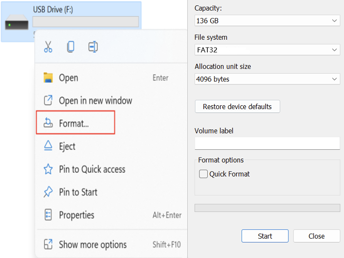
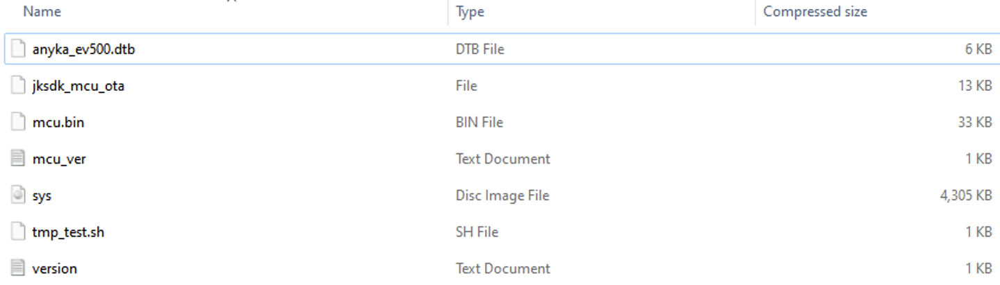
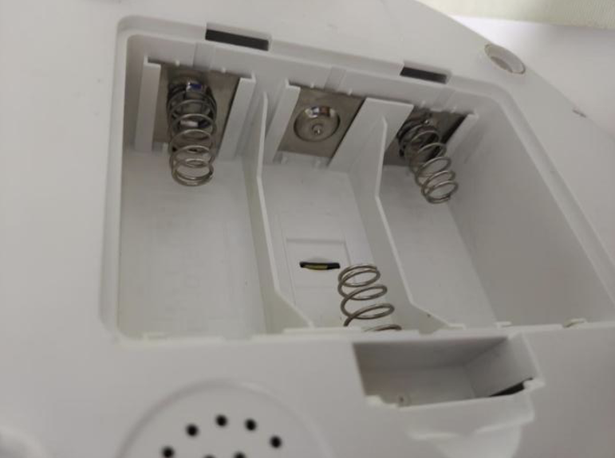

# Micro SD card firmware upgrade process for AF203

1. Insert the micro SD card that is from Sandisk or Kingston into the PC with a card reader, and then format it to FAT32. (Please use a micro SD card that is less than 32GB, you can also format it to MS-DOS if you use a Mac OS system)

    

2. Unzip the file “V330L_PLAF203_SD_230221_1817_56.34.56_new” and put the extracted 7 files in the root directory of the micro SD card.

    **The file content of the micro SD card after decompression is as shown below:**
    

3. Reset the feeder, unplug the power cable and remove the batteries, then insert the micro SD card into the device, and then power on the feeder again (Do not install the batteries) and the feeder will start updating the firmware automatically.

    

4. During the firmware upgrade, the network indicator of the device flashes quickly (twice a second). When the upgrade is completed, the WiFi indicator of the device will flash twice a second with a stop and then repeat.

5. After the update is completed, please power off the feeder, remove the microSD card and power it back on to check if the feeder could be connected. (Please reset the feeder again before trying to connect it.)

6. If the feeder connect to the App successfully, please format the micro SD on your PC before inserting it into the feeder.